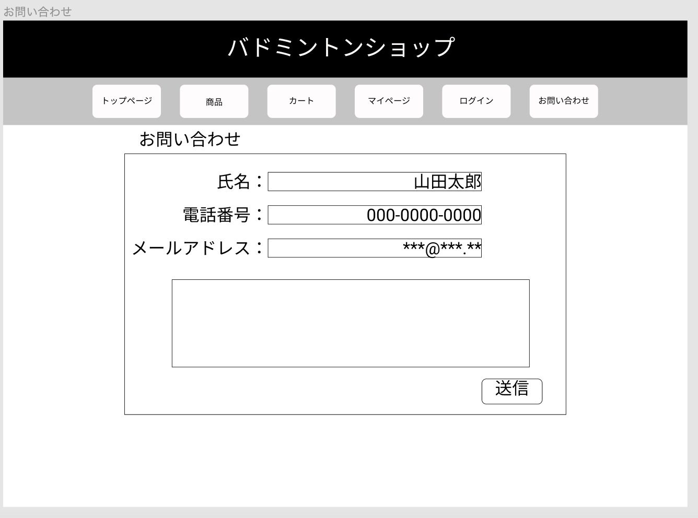

### 画面詳細図
## お問い合わせ
### プロトタイプは以下のリンク先
[プロトタイプ](https://www.figma.com/file/xd5QU5AZieLSmIfT1NGZW3/original?node-id=30%3A1294)
*****

*****

補足:対応DBの列はDB設計後、○を対応するテーブル・カラム名に差し替えること。

| ID | 検索 | 内容 | アクション | イベント | 対応DB |
|----|-----|-----|---------|--------|-------|
|1|ヘッダー|サイト名表示|-|-|-|
|2|トップページ|ボタン|クリック|トップページへ遷移|○|
|3|商品|ボタン|クリック|商品一覧へ遷移|○|
|4|カート|ボタン|クリック|カート内へ遷移|○|
|4|マイページ|ボタン|クリック|マイページへ遷移|○|
|5|ログイン|ボタン|クリック|ログインへ遷移|○|
|6|お問い合わせ|ボタン|クリック|お問い合わせへ遷移|○|
|7|お問い合わせ|テキスト表示|-|-|-|
|8|氏名|テキスト表示|-|-|-|
|9|氏名|テキストボックス|入力値|-|○|
|10|電話番号|テキスト表示|-|-|-|
|11|電話番号|テキストボックス|入力値|-|○|
|12|メールアドレス|テキスト表示|-|-|-|
|13|メールアドレス|テキストボックス|入力値|-|○|
|14|お問い合わせ|テキストボックス|入力値|-|○|
|15|送信|ボタン|クリック|お問い合わせ完了へ遷移|○|

