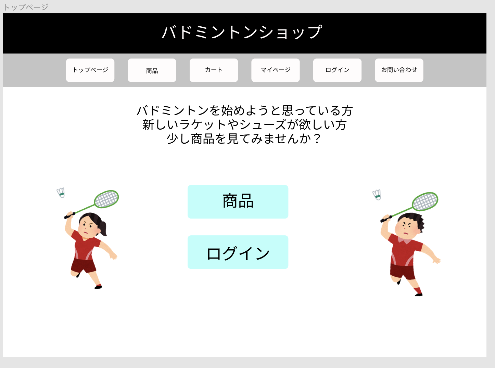

### 画面詳細図
## トップページ
### プロトタイプは以下のリンク先
[プロトタイプ](https://www.figma.com/file/xd5QU5AZieLSmIfT1NGZW3/original?node-id=30%3A1294)
*****

*****

補足:対応DBの列はDB設計後、○を対応するテーブル・カラム名に差し替えること。

| ID | 検索 | 内容 | アクション | イベント | 対応DB |
|----|-----|-----|---------|--------|-------|
|1|ヘッダー|サイト名表示|-|-|-|
|2|トップページ|ボタン|クリック|トップページへ遷移|○|
|3|商品|ボタン|クリック|商品一覧へ遷移|○|
|4|マイページ|ボタン|クリック|マイページへ遷移|○|
|5|ログイン|ボタン|クリック|ログインへ遷移|○|
|6|お問い合わせ|ボタン|クリック|お問い合わせへ遷移|○|
|7|ログインボタン|ボタン|クリック|ログイン処理実行|-|
|8|バドミントン画像(男)|画像表示|-|-|-|
|9|バドミントン画像(女)|画像表示|-|-|-|
|10|　サイト紹介文|テキスト表示|-|-|-|
|11|商品|ボタン|クリック|商品一覧へ遷移|○|
|12|ログイン|ボタン|クリック|ログインへ遷移|○|

