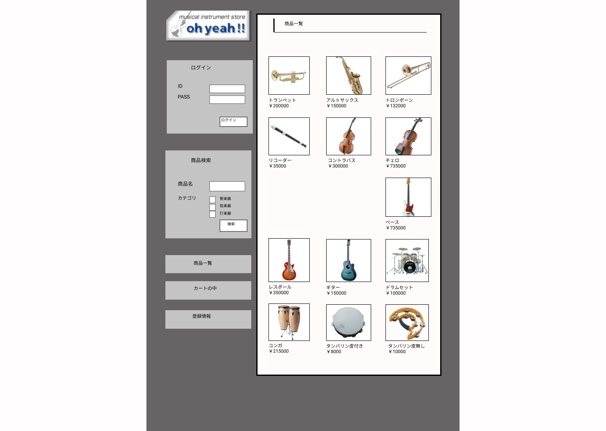

### 画面詳細図
## トップページ
### プロトタイプは以下のリンク先
[プロトタイプ](https://www.figma.com/file/MsLe67oltCC0aFx4j95ie7/sample?node-id=1%3A2)
*****

*****

補足:対応DBno列はDB設計後、○を対応するテーブル・カラム名に差し替えること。

| ID | 検索 | 内容 | アクション | イベント | 対応DB |
|----|-----|-----|---------|--------|-------|
|1|バナー|サイト名表示|-|-|-|
|2|ログイン|テキスト画像|-|-|-|
|3|ID|テキスト表示||||
|4|ID|入力値||||
|5|PASS|テキスト表示||||
|6|PASS|入力値||||
|7|ログインボタン|ボタン||||
|8|商品検索|テキスト画像||||
|9|商品名|テキスト表示||||
|10|商品名|入力値||||
|11|カテゴリ|テキスト表示||||
|12|管楽器|テキスト表示||||
|13|管楽器|チェックボックス||||
|14|弦楽器|テキスト表示||||
|15|弦楽器|チェックボックス||||
|16|打楽器|テキスト表示||||
|17|打楽器|チェックボックス||||
|18|検索ボタン|ボタン||||
|19|商品一覧|画像ボタン||||
|20|カートの中|画像ボタン||||
|21|登録情報|画像ボタン||||
|22|商品一覧|テキスト表示||||
|23|商品画像|画像リンク||||
|24|商品名|テキストリンク||||
|25|価格|テキスト表示||||
